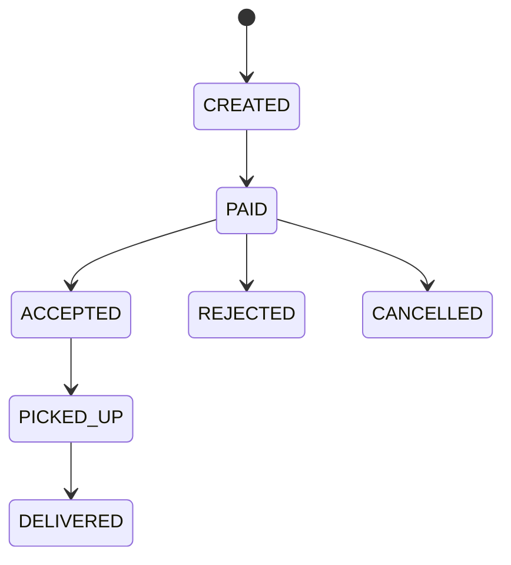
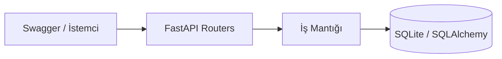
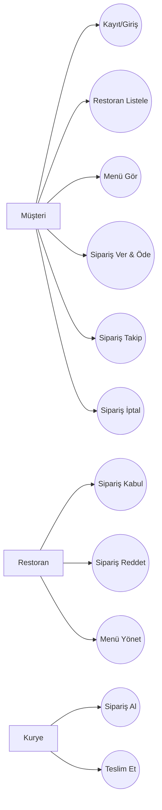
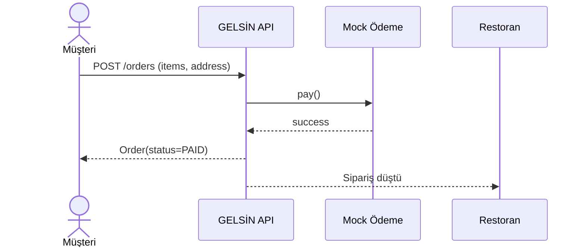
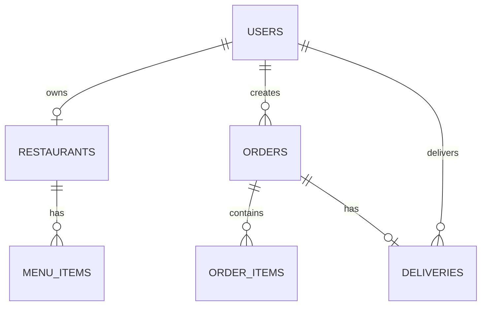

# GELSİN — Yemek Sipariş & Teslimat Sistemi

**Slogan:** *“Sipariş ver, gelsin!”*

- **Hazırlayan:** Muhammet KUTLU
- **Repo:** `https://github.com/<kullanici_adi>/gelsin` *(burayı kendi linkinle değiştir)*

---

## 
**GELSİN**, müşterinin restorandan yemek siparişi verdiği; restoranın siparişi kabul/ret ettiği ve kuryenin siparişi alıp teslim ettiği uçtan uca bir sipariş yönetim sistemidir.


## İçindekiler
- [Aktörler](#aktörler)
- [Analiz Modeli (Gereksinimler)](#analiz-modeli-gereksinimler)
- [Use Case’ler](#use-caseler)
- [Detaylı Use Case Senaryoları](#detaylı-use-case-senaryoları)
- [Tasarım Modeli (Mimari)](#tasarım-modeli-mimari)
- [Veri Modeli (ER)](#veri-modeli-er)
- [API Endpoint Listesi](#api-endpoint-listesi)
- [Kurulum ve Çalıştırma](#kurulum-ve-çalıştırma)
- [Proje Klasör Yapısı](#proje-klasör-yapısı)

---

## Aktörler
- **Müşteri (CUSTOMER):** Restoran/menü görür, sipariş verir, siparişini takip eder, uygun aşamada iptal eder.
- **Restoran Yetkilisi (RESTAURANT):** Siparişi kabul eder veya reddeder, menü yönetir.
- **Kurye (COURIER):** Siparişi üstlenir (pickup) ve teslim eder (deliver).

---

## Analiz Modeli (Gereksinimler)

### Fonksiyonel Gereksinimler (FR)
- **FR1:** Kullanıcı kayıt ve giriş yapabilmeli (rol bazlı).
- **FR2:** Restoranlar listelenebilmeli.
- **FR3:** Restoran menüsü görüntülenebilmeli.
- **FR4:** Müşteri sipariş oluşturabilmeli (ürün + adet + adres).
- **FR5:** Ödeme adımı olmalı (bu projede **mock ödeme**).
- **FR6:** Restoran siparişi **kabul** edebilmeli.
- **FR7:** Restoran siparişi **ret** edebilmeli.
- **FR8:** Kurye siparişi **üstlenebilmel**i (pickup).
- **FR9:** Kurye siparişi **teslim edildi** yapabilmeli.
- **FR10:** Kullanıcı kendi siparişlerini görebilmeli (`/orders/me`).
- **FR11:** Müşteri belirli aşamaya kadar siparişi iptal edebilmeli.

### Fonksiyonel Olmayan Gereksinimler (NFR)
- **NFR1:** Rol bazlı yetkilendirme (RBAC) uygulanmalı.
- **NFR2:** Parolalar **hash’li** saklanmalı (bcrypt).
- **NFR3:** Sipariş durum geçişleri kurallı olmalı (her durumdan her duruma geçiş yok).
- **NFR4:** API hata kodları ve mesajları anlaşılır olmalı (400/401/403/404).

### Kapsam (Scope)
**Kapsam içi:** restoran + menü, sipariş oluşturma, restoran kabul/ret, kurye pickup/deliver, sipariş takibi  
**Kapsam dışı (bilerek):** gerçek ödeme entegrasyonu, harita/konum, kupon-kampanya, canlı bildirim

---

## Use Case’ler
- **UC1:** Kayıt Ol
- **UC2:** Giriş Yap
- **UC3:** Restoranları Listele
- **UC4:** Menü Görüntüle
- **UC5:** Sipariş Oluştur & Öde (Mock)
- **UC6:** Sipariş İptal Et
- **UC7:** Restoran Siparişi Kabul Et
- **UC8:** Restoran Siparişi Reddet
- **UC9:** Kurye Siparişi Al (Pickup)
- **UC10:** Kurye Siparişi Teslim Et (Deliver)
- **UC11:** Siparişleri Görüntüle (`/orders/me`)

---

## Detaylı Use Case Senaryoları

### UC5 — Sipariş Oluştur & Öde (Mock)
**Amaç:** Müşteri sipariş verir ve ödeme tamamlanır.  
**Ön Koşullar:** Müşteri giriş yapmıştır. Restoran ve menü ürünleri geçerlidir.

**Ana Akış:**
1. Müşteri restoran seçer, ürün(ler) ve adet(ler)i belirler.
2. Müşteri teslimat adresini girer.
3. Sistem toplam tutarı hesaplar.
4. Müşteri ödeme başlatır (**mock**).
5. Ödeme başarılı döner.
6. Sistem siparişi `PAID` durumunda oluşturur.
7. Sipariş restorana düşer.

**Alternatif Akışlar:**
- **A1 (Ödeme başarısız):** Mock ödeme başarısızsa sipariş oluşturulmaz, hata döner.
- **A2 (Geçersiz ürün):** Menü ürünü restorana ait değilse veya pasifse sipariş engellenir.

### UC7 — Restoran Siparişi Kabul Et
**Amaç:** Restoran gelen siparişi kabul eder.  
**Ön Koşullar:** Sipariş durumu `PAID` olmalıdır.

**Ana Akış:**
1. Restoran siparişi görüntüler.
2. “Kabul Et” seçer.
3. Sistem siparişi `ACCEPTED` durumuna getirir.

**Alternatif Akışlar:**
- **B1:** Sipariş `PAID` değilse sistem kabul işlemini reddeder.

### UC10 — Kurye Siparişi Teslim Et
**Amaç:** Kurye siparişi üstlenir ve teslim eder.  
**Ön Koşullar:** Kurye giriş yapmıştır. Sipariş pickup için uygun durumdadır (`ACCEPTED`).

**Ana Akış:**
1. Kurye pickup yapar → sistem siparişi `PICKED_UP` yapar.
2. Kurye teslim eder → sistem siparişi `DELIVERED` yapar.

**Alternatif Akışlar:**
- **C1:** Sipariş başka kuryeye atanmışsa sistem engeller.
- **C2:** Pickup yapılmadan deliver denenirse sistem engeller.

---

## Tasarım Modeli (Mimari)

### Mimari Yaklaşım
Proje, hızlı geliştirme ve net modelleme amacıyla **Monolith REST API + DB** şeklinde tasarlanmıştır.

- **API Katmanı (FastAPI Routers):** `auth`, `restaurants`, `orders`
- **İş Mantığı:** rol kontrolleri, sipariş durum kuralları, toplam hesaplama
- **Veri Katmanı:** SQLite + SQLAlchemy

### Sipariş Durumları (State)


### Mimari Diyagram (Basit)


---

## Veri Modeli (ER)

### Tablolar (Özet)
- `users` (id, full_name, email, password_hash, role)
- `restaurants` (id, name, address, is_open, owner_user_id)
- `menu_items` (id, restaurant_id, name, price, is_active)
- `orders` (id, customer_id, restaurant_id, address_text, status, total, created_at)
- `order_items` (id, order_id, menu_item_id, name_snapshot, price_snapshot, qty)
- `deliveries` (id, order_id, courier_id)

### Use Case Diyagramı (Aktörler ve Use Case’ler)


### Sipariş Oluşturma & Ödeme — Sequence Diagram


### ER Diyagramı


---

## API Endpoint Listesi

### Auth
- `POST /auth/register`
- `POST /auth/login`

### Restaurants
- `GET /restaurants`
- `POST /restaurants` *(RESTAURANT)*
- `GET /restaurants/{id}/menu`
- `POST /restaurants/{id}/menu` *(RESTAURANT)*

### Orders
- `POST /orders` *(CUSTOMER)* — mock ödeme ile sipariş oluşturur
- `GET /orders/me` *(tüm roller)* — kendi siparişlerini listeler
- `PATCH /orders/{id}/cancel` *(CUSTOMER)*
- `PATCH /orders/{id}/accept` *(RESTAURANT)*
- `PATCH /orders/{id}/reject` *(RESTAURANT)*
- `PATCH /orders/{id}/pickup` *(COURIER)*
- `PATCH /orders/{id}/deliver` *(COURIER)*

---

## Kurulum ve Çalıştırma

### Gereksinimler
- Python 3.10+ (önerilir)

### Kurulum
```bash
python -m venv .venv
# Windows: .venv\Scripts\activate
source .venv/bin/activate

pip install -r requirements.txt

cp .env.example .env
# .env içindeki SECRET_KEY'i değiştir

uvicorn app.main:app --reload
```

### Çalışan URL’ler
- Health: `http://127.0.0.1:8000/health`
- Swagger UI: `http://127.0.0.1:8000/docs`

---


## Proje Klasör Yapısı
```text
gelsin/
  app/
    main.py
    db.py
    models.py
    schemas.py
    security.py
    deps.py
    routers/
      auth.py
      restaurants.py
      orders.py
  requirements.txt
  README.md
  .env.example
  .gitignore
  docs/
    flyer.pdf
```

---


